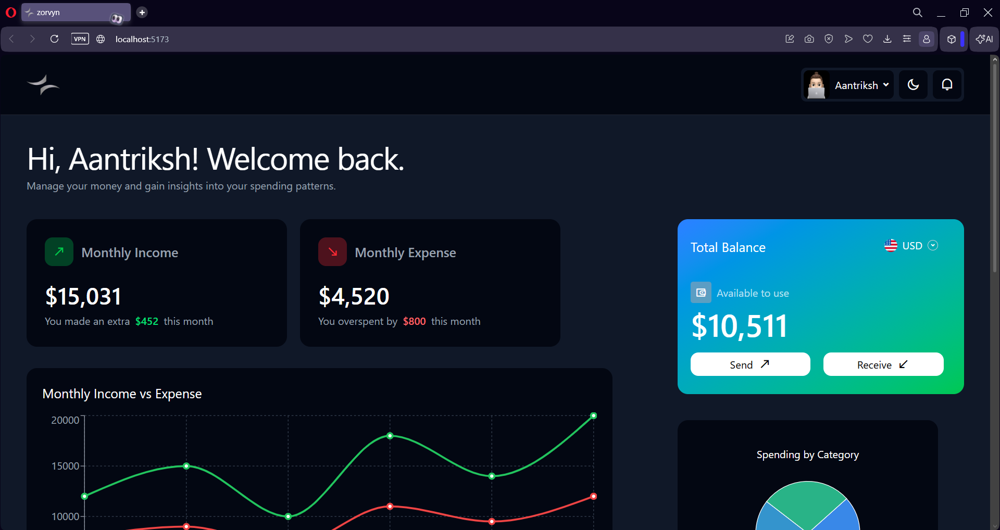
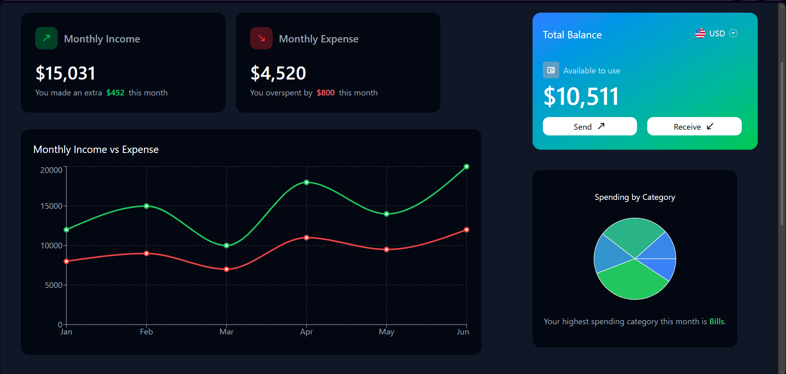
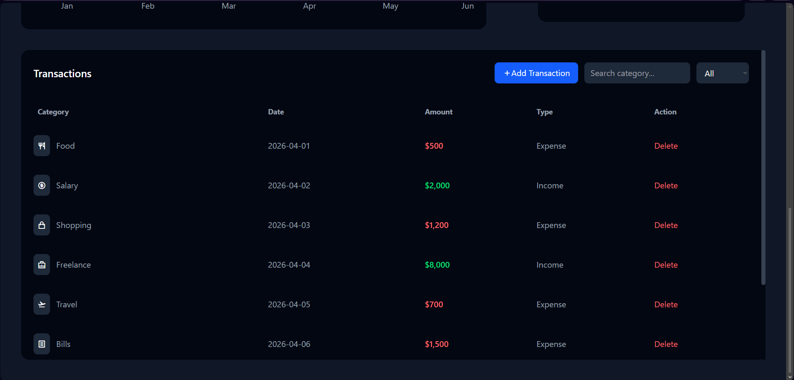
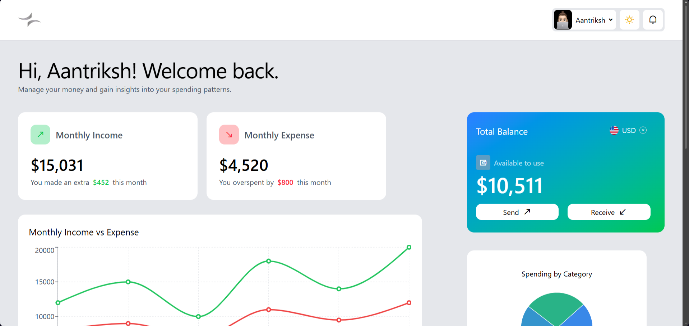
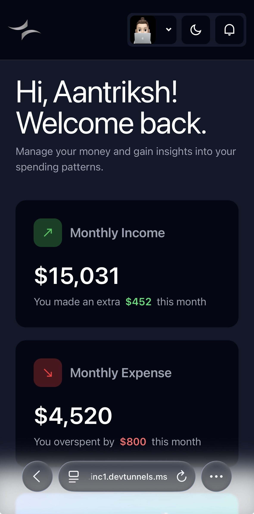
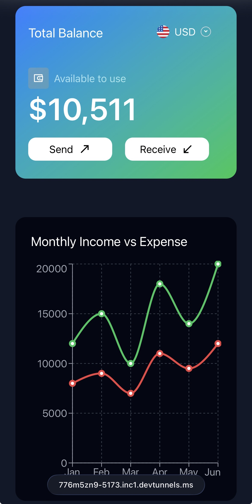
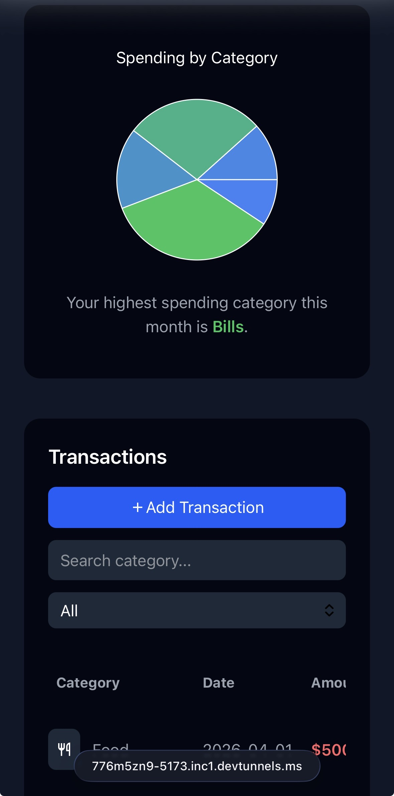
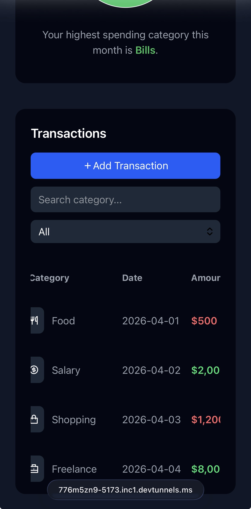
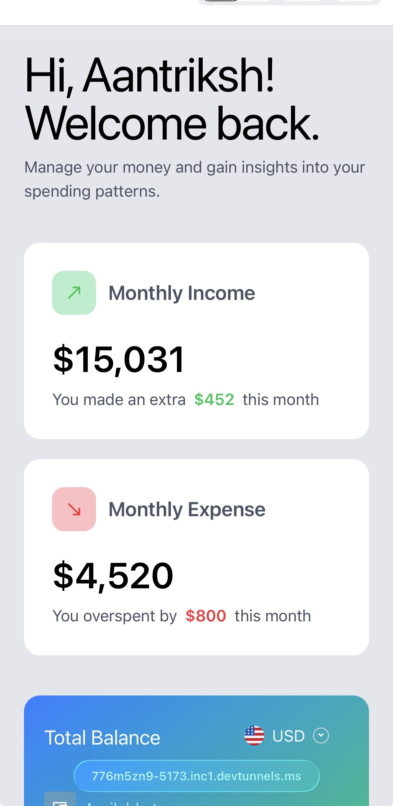

# 💰 ZORVYN – Finance Dashboard

A modern and responsive finance dashboard built using **React (Vite)**, designed to track transactions, visualize financial data, and simulate real-world features like role-based access and theme switching.

---

## 🚀 Features

### 📊 Dashboard Overview

* Displays **Monthly Income, Expense, and Total Balance**
* Clean card-based layout with responsive design

### 📈 Data Visualization

* **Line Chart** → Monthly Income vs Expense trends
* **Pie Chart** → Category-wise expense breakdown with dynamic gradient colors
* **Insights Section** → Dynamically analyzes transaction data to highlight key patterns such as the highest spending category

### 🧾 Transactions Table

* View transactions with:

  * Category (with icons)
  * Date
  * Amount (color-coded)
  * Type (Income / Expense)
* **Search** by category
* **Filter** by transaction type
* Fully **responsive with horizontal scroll on mobile**

### 🔐 Role-Based Access Control (RBAC)

* **Admin**

  * Add transaction (UI)
  * Delete transaction (state-based)
* **Viewer**

  * Read-only access

### 🗑️ Delete Simulation + Toast

* Transactions removed using React state
* Toast notification shown after deletion

### 🌗 Theme Toggle

* Switch between **Dark Mode** and **Light Mode**
* Applied across all components

### 🎨 UI Enhancements

* Custom scrollbar styling
* Smooth transitions & hover effects
* Mobile-first responsive layout

---

## 🛠️ Tech Stack

* **React (Vite)**
* **Tailwind CSS**
* **Recharts**
* **Remix Icons**

---

## 📁 Project Structure

```bash
ZORVYN/
│
├── public/
│   └── screenshots/        # Project screenshots
│
├── src/
│   ├── assets/
│   │   ├── me.jpeg
│   │   ├── USD.png
│   │   └── zorvynlogolight.png
│   │
│   ├── components/
│   │   ├── DashboardCards.jsx
│   │   ├── linechart.jsx
│   │   ├── piechartcomp.jsx
│   │   └── Table.jsx
│   │
│   ├── data/
│   │   └── mockdata.js
│   │
│   ├── pages/
│   │   └── Dashboard.jsx
│   │
│   ├── App.jsx
│   ├── App.css
│   ├── index.css
│   └── main.jsx
│
├── index.html
├── package.json
├── vite.config.js
└── README.md
```

---

## ⚙️ Installation & Setup

```bash
# Clone repository
git clone <your-repo-link>

# Navigate to project
cd ZORVYN

# Install dependencies
npm install

# Run development server
npm run dev
```

---

## 💡 Key Implementation Highlights

* **Data Aggregation**

  * Grouped transactions by category to generate chart data

* **State Management**

  * Used React state for:

    * Theme toggle
    * Role switching
    * Transaction deletion

* **Dynamic Styling**

  * Conditional Tailwind classes for theme switching

* **Responsive Design**

  * Mobile-first layout using Tailwind breakpoints

---

## 📸 Screenshots

### Dashboard


### Charts


### Transaction Table


### Light Theme


<h3>📱 Mobile View</h3>

<div style="display: grid; grid-template-columns: repeat(2, 1fr); gap: 10px;">
  
  
  
  
  
</div>

---

## 🧠 Future Improvements

* Add transaction form (modal)
* Persist data using localStorage or backend
* Add authentication system
* Advanced analytics & insights

---

## 👨‍💻 Author

Developed as part of a frontend assignment to demonstrate:

* UI/UX skills
* Data visualization
* State management
* Responsive design

---

## ⭐ Conclusion

This project demonstrates a complete frontend dashboard with real-world features such as charts, RBAC, theme switching, and responsive UI—simulating a production-level finance application.

---
